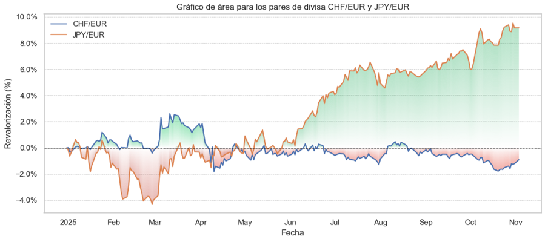
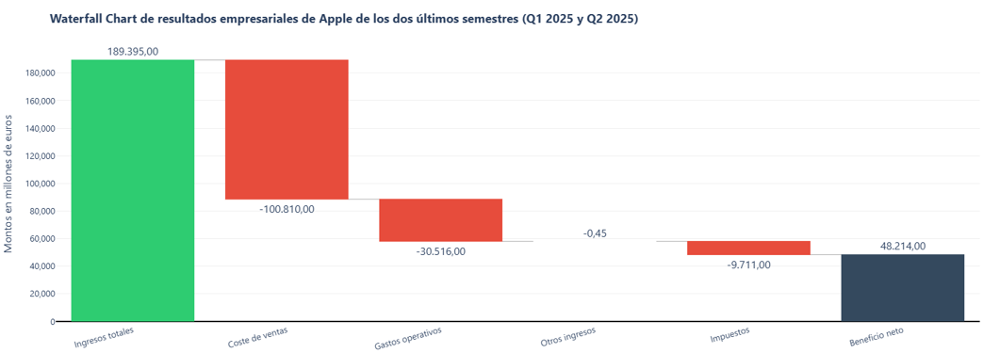
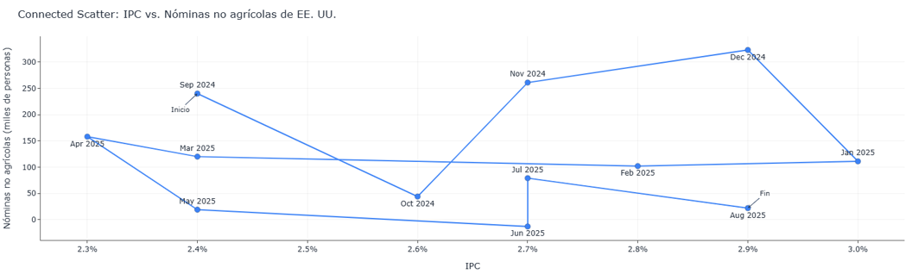

# Visualización de Datos — PEC 2 (Máster universitario en Ciencia de Datos - UOC)

Este repositorio contiene los códigos y datos utilizados para la **Práctica 2 (PEC 2)** de la asignatura **Visualización de Datos** del *Máster Universitario en Ciencia de Datos* de la **Universitat Oberta de Catalunya (UOC)**.

El objetivo de esta práctica es **explorar y aplicar nuevas técnicas de visualización** saliendo de la zona de confort habitual, entendiendo su esencia y adecuación según el tipo de datos y el objetivo comunicativo.

---

## Objetivos de la PEC 2

- Investigar **tres técnicas de visualización asignadas**.
- Analizar su origen, autoría, ventajas, limitaciones y usos más comunes.
- Determinar los **tipos de datos más adecuados** para cada técnica.
- Crear **una visualización práctica por técnica** utilizando datos abiertos.
- Publicar las visualizaciones online y acompañarlas de un **comentario analítico**.
- Elaborar un **vídeo explicativo (7–8 min máx.)** siguiendo el guion oficial de la PEC.

---

## Técnicas de visualización trabajadas

| Técnica | Descripción breve | Archivo Jupyter asociado |
|----------|------------------|---------------------------|
| **Area Chart** | Representa la evolución de una variable cuantitativa en el tiempo mediante un área rellena bajo una línea. Ideal para mostrar tendencias acumuladas. | [`Area_Chart.ipynb`](./Area_Chart.ipynb) |
| **Waterfall Chart** | Muestra cómo un valor inicial se ve afectado por una serie de incrementos y decrementos sucesivos. Muy útil para desglosar la variación de un total. | [`Waterfall_Chart.ipynb`](./Waterfall_Chart.ipynb) |
| **Connected Scatter Plot** | Une puntos de un diagrama de dispersión según su orden temporal, permitiendo observar simultáneamente relaciones y evolución en el tiempo. | [`Connected_Scattered_Chart.ipynb`](./Connected_Scattered_Chart.ipynb) |

---

## Estructura del repositorio

- ├── Area_Chart.ipynb # Notebook con el gráfico de área
- ├── Connected_Scattered_Chart.ipynb # Notebook con el connected scatter plot
- ├── Waterfall_Chart.ipynb # Notebook con el gráfico de cascada
- ├── datos_area_chart.csv # Datos para el gráfico de área
- ├── datos_connected_scattered_chart.xlsx # Datos para el gráfico connected scatter
- └── README.md # Este archivo

---

## Visualizaciones finales

### 1. Area Chart
Representa la evolución temporal de una variable cuantitativa.  
Permite apreciar **tendencias acumuladas y proporciones** a lo largo del tiempo.  

**Objetivo comunicativo:**  
Mostrar la evolución y el peso relativo de los valores en un periodo, destacando zonas de crecimiento y decrecimiento.

---

### 2. Waterfall Chart
Descompone el cambio de un valor total en sus **incrementos y decrementos parciales**.  
Se utiliza para **explicar variaciones netas** entre dos puntos.

**Objetivo comunicativo:**  
Visualizar cómo diferentes factores contribuyen positiva o negativamente a un resultado final (por ejemplo, beneficios netos o evolución de ingresos).

---

### 3. Connected Scatter Plot
Conecta puntos en un diagrama de dispersión siguiendo el orden temporal.  
Permite observar simultáneamente **correlación y evolución**.

**Objetivo comunicativo:**  
Analizar cómo dos variables evolucionan conjuntamente en el tiempo, identificando direcciones de cambio, patrones cíclicos o rupturas de tendencia.

---

## Fuentes de referencia

Para la documentación de las técnicas se consultaron las siguientes webs:

- [Data to Viz](https://www.data-to-viz.com/)
- [The Data Visualization Catalogue](https://datavizcatalogue.com/ES/)
- [DataViz Project](https://datavizproject.com/)

---

## Tecnologías utilizadas

- **Lenguaje:** Python 3.x  
- **Entorno:** Jupyter Notebook  
- **Librerías principales:**  
  - `pandas`  
  - `matplotlib`  
  - `plotly`  
  - `numpy`  

---

## Autor

**Nombre:** David Alvaro Berlanga
**Asignatura:** Visualización de Datos  
**Máster Universitario en Ciencia de Datos — UOC**  
**Curso académico:** 2025–2026  

